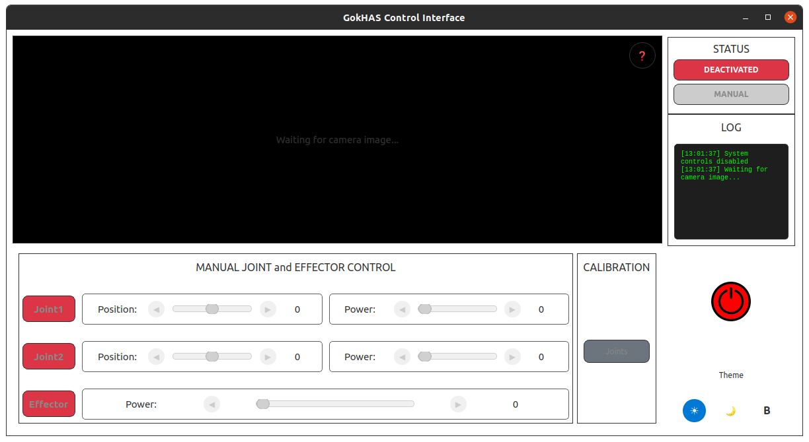
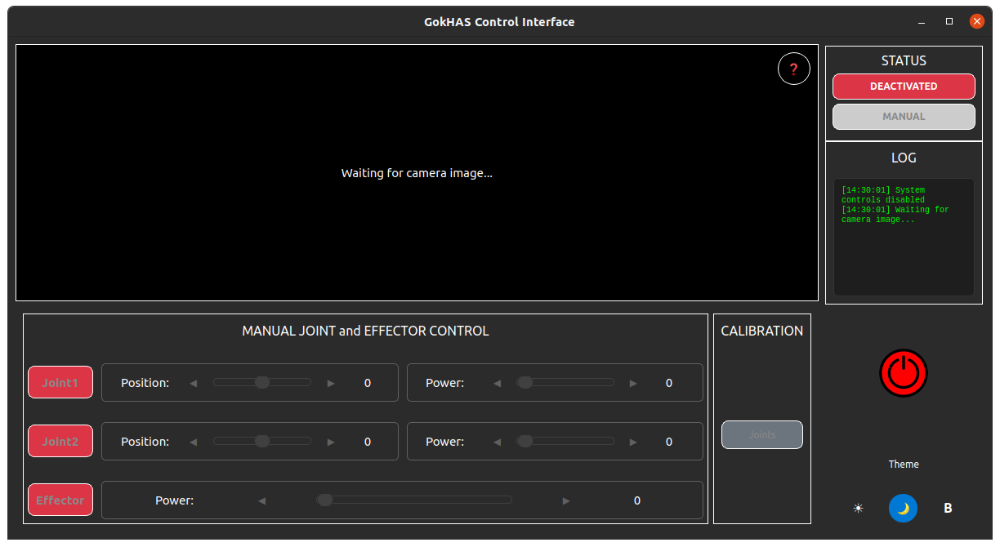

# GokHAS Project

GokHAS was developed as an undergraduate capstone project, featuring a custom two-axis turret integrated with an Airsoft system. A GUI-based centralized management interface provides a robust software architecture for target acquisition and engagement. On the embedded side, an STM32 microcontroller handles real-time control and telemetry over UART communication. This end-to-end design demonstrates seamless coordination between high-level command software and low-level embedded hardware.

## GUI Interface

The GokHAS system features a modern PyQt6-based interface with dual theme support:

| Light Theme | Dark Theme |
|-------------|------------|
|  |  |

*Advanced control interface with real-time camera feed, joint controls, and comprehensive system monitoring*

## Project Overview

The GokHAS system consists of three main ROS packages:

- **[gokhas_perception](gokhas_perception/)** - Computer vision and perception stack for target detection and tracking using YOLOv8
- **[gokhas_communication](gokhas_communication/)** - Bidirectional UART communication interface with STM32 microcontroller
- **[gokhas_interface](gokhas_interface/)** - Advanced PyQt6-based GUI with real-time calibration and control system

## System Architecture

```
┌─────────────────┐    ┌──────────────────┐    ┌─────────────────┐
│  GUI Interface  │◄──►│   ROS Messages   │◄──►│   Perception    │
│   (gokhas_      │    │ (gokhas_commu-   │    │  (gokhas_per-   │
│   interface)    │    │  nication)       │    │   ception)      │
└─────────────────┘    └──────────────────┘    └─────────────────┘
         │                       │                       │
         │                       │                       │
         v                       v                       v
┌─────────────────┐    ┌──────────────────┐    ┌─────────────────┐
│     PyQt6       │    │   STM32 MCU      │    │  Camera/Sensors │
│      GUI        │    │   (UART Comm)    │    │   (ZED Camera)  │
└─────────────────┘    └──────────────────┘    └─────────────────┘
```

## Prerequisites

## Prerequisites

### System Requirements
- **Operating System:** Ubuntu 20.04 LTS
- **ROS Version:** ROS Noetic (must be installed and sourced)
- **Python:** 3.8+ (included with Ubuntu 20.04)
- **Hardware:** NVIDIA GPU (recommended for ZED SDK)

### Hardware Requirements
- **Camera:** ZED Stereo Camera (optional - can run in simulation)
- **Microcontroller:** STM32 with UART communication (optional - can run in simulation)
- **Actuators:** Two-axis servo/stepper motor system
- **Mechanism:** Airsoft firing system

### Before Installation

1. **Ensure ROS Noetic is installed and sourced:**
```bash
# Check if ROS is sourced
echo $ROS_DISTRO  # Should output: noetic

# If ROS is not installed, install it first:
# Follow: http://wiki.ros.org/noetic/Installation/Ubuntu

# Ensure ROS is sourced in your .bashrc
echo "source /opt/ros/noetic/setup.bash" >> ~/.bashrc
source ~/.bashrc
```

2. **Create your catkin workspace:**
```bash
mkdir -p ~/catkin_ws/src
cd ~/catkin_ws/src
```

> **✅ Streamlined Setup:** All other dependencies (system packages, Python libraries, ROS packages) will be automatically installed using the provided installation scripts. No manual dependency installation required!

## Installation

### Automated Installation (Recommended)

The GokHAS project provides automated installation scripts that handle all dependencies and setup:

1. **Clone the repository:**
```bash
cd ~/catkin_ws/src
git clone <repository-url> gokhas_project
cd gokhas_project
```

2. **Run the main installation script:**
```bash
# Install all dependencies (system packages, ROS packages, Python packages)
./install.sh
```

3. **Install ZED SDK (if using ZED camera):**
```bash
# Run ZED SDK installer
./install_zed_sdk.sh
```

4. **Build the workspace:**
```bash
cd ~/catkin_ws
catkin_make
# or if you prefer catkin build:
# catkin build
```

5. **Source the workspace:**
```bash
source ~/catkin_ws/devel/setup.bash
```

### Manual Installation (Alternative)

If you prefer manual installation or encounter issues with the automated scripts:

<details>
<summary>Click to expand manual installation steps</summary>

1. **Clone the repository:**
```bash
cd ~/catkin_ws/src
git clone <repository-url> gokhas_project
```

2. **Install system dependencies:**
```bash
sudo apt-get update
sudo apt-get install -y python3-pip python3-dev build-essential cmake git pkg-config
```

3. **Install Python dependencies:**
```bash
# PyQt6 for interface
pip3 install PyQt6 pyserial

# Computer vision
pip3 install opencv-python

# Install perception requirements
cd ~/catkin_ws/src/gokhas_project/gokhas_perception
pip3 install -r requirements.txt

# Additional ROS Python packages
pip3 install rospkg pyyaml catkin_pkg empy defusedxml netifaces
```

4. **Install ROS dependencies:**
```bash
cd ~/catkin_ws
rosdep update
rosdep install --from-paths src --ignore-src -r -y
```

5. **Install ZED SDK (optional for camera):**
```bash
# Download from https://www.stereolabs.com/developers/release/
# Or use our automated installer:
cd ~/catkin_ws/src/gokhas_project
./install_zed_sdk.sh
```

6. **Build and source:**
```bash
cd ~/catkin_ws
catkin_make
source ~/catkin_ws/devel/setup.bash
```

</details>

### What the Installation Scripts Do

- **`install.sh`**: Main installer that handles:
  - System package dependencies (build-essential, cmake, etc.)
  - ROS package dependencies via rosdep
  - Python packages (PyQt6, OpenCV, perception requirements)
  - GPG key fixes for ROS repositories
  - Installation verification

- **`install_zed_sdk.sh`**: ZED SDK installer that:
  - Downloads ZED SDK from Google Drive
  - Handles Ubuntu 20.04 compatibility
  - Installs CUDA dependencies if needed
  - Configures ZED ROS wrapper dependencies

### Troubleshooting Installation

<details>
<summary>Common Installation Issues</summary>

**ROS GPG Key Errors:**
```bash
# If you see GPG key errors during installation:
sudo apt-key adv --keyserver keyserver.ubuntu.com --recv-keys F42ED6FBAB17C654
sudo apt-get update
```

**PyQt6 Installation Issues:**
```bash
# If PyQt6 installation fails:
sudo apt-get install python3-pyqt6
# or
pip3 install --upgrade pip
pip3 install PyQt6
```

**Permission Errors:**
```bash
# Never run the install scripts with sudo
# If you get permission errors, fix ownership:
sudo chown -R $USER:$USER ~/catkin_ws
```

**ZED SDK Issues:**
- Ensure NVIDIA drivers are installed: `nvidia-smi`
- Check CUDA compatibility with your GPU
- ZED SDK requires Ubuntu 20.04 or compatible

**Build Errors:**
```bash
# Clean and rebuild if you encounter build issues:
cd ~/catkin_ws
catkin clean  # or rm -rf build/ devel/
catkin_make
```

</details>

## Quick Start

### Launch the Complete System
The GokHAS system uses a delayed launch sequence for proper component initialization:

```bash
# Start all components with proper timing
roslaunch gokhas_interface gokhas_interface.launch
```

This will launch:
- **t=0s**: PyQt6 Interface (immediate startup)
- **t=1s**: UART Communication system  
- **t=2s**: ZED Camera wrapper
- **t=3s**: YOLOv8 Perception/Tracker

### Individual Package Testing

**Interface only:**
```bash
roslaunch gokhas_interface gokhas_interface.launch
```

**Perception only:**
```bash
roslaunch gokhas_perception tracker.launch
```

**Communication only:**
```bash
roslaunch gokhas_communication communication.launch
```

**ZED Camera only:**
```bash
roslaunch zed_wrapper zedm.launch
```

### Simulation Mode

To run without hardware (STM32, ZED camera):
```bash
# Edit config/params.yaml
# Set: stm32/simulation_mode: true
roslaunch gokhas_interface gokhas_interface.launch
```

## Package Details

### gokhas_perception

**Purpose:** Computer vision and perception stack for target detection and tracking

**Key Features:**
- YOLOv8-based object detection and segmentation
- Real-time 3D point cloud processing
- Advanced target tracking with multiple algorithms
- 2D/3D bounding box generation
- Custom message types for detection data

**Nodes:**
- `tracker_node` - Real-time 2D object detection and tracking
- `tracker_with_cloud_node` - 3D object detection with LiDAR integration

**Custom Messages:**
- `Detection2D` - 2D bounding box detection
- `Detection2DArray` - Array of 2D detections
- `YoloResult` - YOLO detection results with segmentation masks

**Dependencies:**
- Ultralytics YOLO models
- OpenCV (cv_bridge)
- PCL (pcl_ros)
- Image processing (image_transport, image_geometry)
- Vision messages (vision_msgs)

### gokhas_communication

**Purpose:** Bidirectional UART communication interface with STM32 microcontroller

**Key Features:**
- Real-time UART communication (100 Hz)
- Compact 8-byte packet protocol
- Trigger-based transmission system
- Joint position and speed control
- Airsoft system control and feedback
- Simulation mode for testing
- Fault-tolerant communication with error handling

**Message Types:**
- `ControlMessage` - Communication and calibration control (2 bytes)
- `JointMessage` - Joint and airsoft control (6 bytes)

**Topics:**
- `/control_topic` - Control and calibration commands
- `/joint_command_topic` - Joint movement commands

**Dependencies:**
- Python serial library
- ROS Python (rospy)
- Custom message generation

### gokhas_interface

**Purpose:** Advanced PyQt6-based GUI with real-time calibration and control system

**Key Features:**
- **Enhanced Calibration System:**
  - STM32 response-based calibration (no fixed timers)
  - Visual feedback: Default → Processing (Yellow/Pulsing) → Completed (Green)
  - Timeout handling (15s) for non-responsive hardware
  - Prevention of simultaneous calibrations
- **Real-time Control:**
  - Manual/autonomous mode switching
  - Individual joint control with position (-135° to +135°) and power (0-100%)
  - Live camera feed display with YOLOv8 detection overlay
- **Advanced UI:**
  - Dynamic theme system (Light/Dark)
  - Comprehensive logging panel with timestamps
  - Configuration management via ROS parameters
  - Responsive design with status-based color coding
- **Communication:**
  - ROS Bridge for seamless topic integration
  - Connection monitoring and status reporting
  - Safe shutdown with resource cleanup

**GUI Screenshots:**

*Light Theme Interface:*


*Dark Theme Interface:*


The interface features a modern, responsive design with real-time camera feed, comprehensive control panels, and dynamic status indicators. The dual-theme system provides optimal visibility in different lighting conditions.

**Configuration:**
- Centralized parameter system in `config/params.yaml`
- Simulation/real hardware mode switching
- Configurable timeouts and delays

**Interface Features:**
- **Real-time Camera Feed**: Live video stream with YOLOv8 detection overlays
- **Joint Control Panel**: Precise position (-135° to +135°) and power (0-100%) control
- **System Status**: Visual indicators for communication, calibration, and operation modes
- **Dual Theme Support**: Light and dark themes for optimal visibility
- **Comprehensive Logging**: Timestamped system events and debug information
- **Safety Features**: Emergency stops, timeout handling, and state validation

**Dependencies:**
- PyQt6 framework
- ROS integration (rospy)
- OpenCV for image processing
- Image processing for display
- Custom message handling

## Usage

### 1. Launch the Camera Node (ZED Camera)
```bash
roslaunch zed_wrapper zed2.launch
```

### 2. Start the Perception Stack
```bash
roslaunch gokhas_perception perception.launch
```

### 3. Launch Communication Node
```bash
roslaunch gokhas_communication communication.launch
```

### 4. Start the GUI Interface
```bash
roslaunch gokhas_interface interface.launch
```

### Alternative: Launch Everything
```bash
roslaunch gokhas_project full_system.launch
```

## Configuration

### Camera Configuration
Edit camera parameters in:
```
gokhas_perception/config/camera_params.yaml
```

### Detection Parameters
Configure YOLO detection settings:
```
gokhas_perception/config/detection_params.yaml
```

### Communication Settings
Set UART and communication parameters:
```
gokhas_communication/config/comm_params.yaml
```

## Topics and Services

### Published Topics
- `/gokhas/detections` - Detection results
- `/gokhas/target_position` - Target coordinates
- `/gokhas/system_status` - System health status

### Subscribed Topics
- `/camera/image_raw` - Camera feed
- `/camera/depth/points` - Point cloud data
- `/gokhas/control_commands` - Manual control inputs

### Services
- `/gokhas/set_mode` - Switch between manual/auto modes
- `/gokhas/calibrate` - System calibration
- `/gokhas/emergency_stop` - Emergency shutdown

## Development

### Building Custom Messages
After adding new message files:
```bash
catkin build gokhas_perception
catkin build gokhas_communication
```

### Running Tests
```bash
catkin_make run_tests
```

### Code Style
- Follow ROS coding standards
- Use meaningful variable names
- Document all public functions
- Add appropriate error handling

## Troubleshooting

### Common Issues

1. **Camera not detected:**
   - Check USB connections
   - Verify ZED SDK installation
   - Check camera permissions

2. **Communication timeout:**
   - Verify STM32 connection
   - Check UART settings
   - Ensure correct baud rate

3. **GUI not responding:**
   - Check PyQt6 installation
   - Verify ROS node connections
   - Check message dependencies

### Debug Commands
```bash
# Check node status
rosnode list
rosnode info /gokhas_perception

# Monitor topics
rostopic echo /gokhas/detections
rostopic hz /camera/image_raw

# View system graph
rosrun rqt_graph rqt_graph
```

## Contributing

1. Fork the repository
2. Create a feature branch
3. Make your changes
4. Add tests if applicable
5. Submit a pull request

## License

This project is licensed under the MIT License - see the LICENSE file for details.

## Authors

- **Ahmet Ceyhun Bilir** - *Lead Developer* - ahmetceyhunbilir16@gmail.com
- **Beyza Meltem Amanet** - *Communication Module* - meltem.aman@gmail.com

## Acknowledgments

- Bachelor's thesis project
- ROS community for excellent documentation
- OpenCV and PCL communities
- Stereolabs for ZED SDK support

## License

This project is licensed under the MIT License - see the details below.

### MIT License

```
Copyright (c) 2025 Ahmet Ceyhun Bilir

Permission is hereby granted, free of charge, to any person obtaining a copy
of this software and associated documentation files (the "Software"), to deal
in the Software without restriction, including without limitation the rights
to use, copy, modify, merge, publish, distribute, sublicense, and/or sell
copies of the Software, and to permit persons to whom the Software is
furnished to do so, subject to the following conditions:

The above copyright notice and this permission notice shall be included in all
copies or substantial portions of the Software.

THE SOFTWARE IS PROVIDED "AS IS", WITHOUT WARRANTY OF ANY KIND, EXPRESS OR
IMPLIED, INCLUDING BUT NOT LIMITED TO THE WARRANTIES OF MERCHANTABILITY,
FITNESS FOR A PARTICULAR PURPOSE AND NONINFRINGEMENT. IN NO EVENT SHALL THE
AUTHORS OR COPYRIGHT HOLDERS BE LIABLE FOR ANY CLAIM, DAMAGES OR OTHER
LIABILITY, WHETHER IN AN ACTION OF CONTRACT, TORT OR OTHERWISE, ARISING FROM,
OUT OF OR IN CONNECTION WITH THE SOFTWARE OR THE USE OR OTHER DEALINGS IN THE
SOFTWARE.
```

## Project Status

This project is actively developed as part of a bachelor's thesis. Current focus areas:
- Improving detection accuracy
- Enhancing real-time performance
- Expanding GUI functionality
- Adding safety features

For questions or support, please contact the maintainers or create an issue in the repository.
